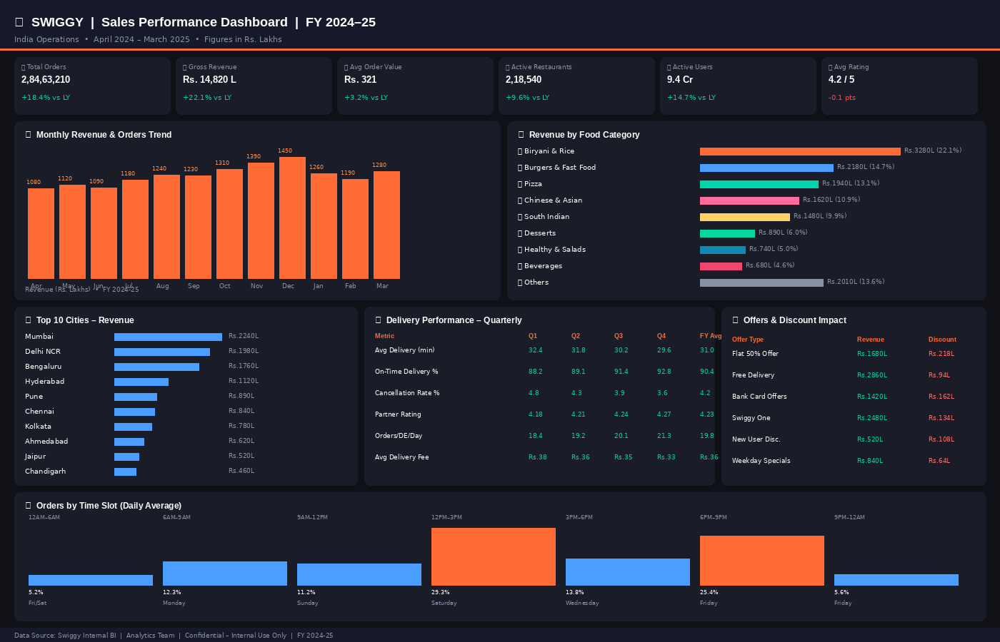

# 🧡 Swiggy Sales Dashboard — FY 2024–25



> An end-to-end sales analytics project for Swiggy India — built with **Excel**, **SQL**, and **Power BI**  
> Covers 2.84 Crore+ orders · ₹14,820 Lakhs Gross Revenue · April 2024 – March 2025

---

## 📌 Project Overview

This project analyzes Swiggy's sales performance across India for FY 2024–25. It includes raw data, SQL queries for data exploration, and a fully formatted Excel dashboard with charts and KPIs.

### What's Analyzed
- 📈 Monthly Revenue & Orders Trend
- 🍕 Revenue by Food Category (Biryani, Pizza, Burgers, etc.)
- 🏙️ Top 10 Cities by Revenue & Orders
- ⏰ Orders by Time Slot (peak hours analysis)
- 🛵 Delivery Performance (on-time rate, avg time, cancellations)
- 📣 Offers & Discount Impact on Net Revenue
- 🏪 Outlet Performance & Location Tier Analysis

---

## 📁 Repository Structure

```
swiggy-sales-dashboard/
│
├── data/
│   ├── swiggy_raw_data.csv           ← Raw monthly data (12 months)
│   ├── swiggy_city_data.csv          ← City-wise revenue & orders
│   ├── swiggy_category_data.csv      ← Food category breakdown
│   ├── swiggy_delivery_data.csv      ← Delivery metrics by quarter
│   └── swiggy_offers_data.csv        ← Offers & discount analysis
│
├── sql/
│   ├── 01_create_tables.sql          ← Table creation scripts
│   ├── 02_data_analysis.sql          ← Core analysis queries
│   ├── 03_kpi_queries.sql            ← KPI calculation queries
│   └── 04_advanced_queries.sql       ← Window functions, CTEs, rankings
│
├── swiggy_sales_dashboard.xlsx       ← Main Excel dashboard file
│
├── docs/
│   └── data_dictionary.md            ← Column definitions & notes
│
├── assets/
│   └── dashboard-preview.png         ← Screenshot for README
│
└── README.md
```

---

## 📊 Dashboard Highlights

| KPI | Value | YoY Change |
|-----|-------|------------|
| Gross Revenue | ₹14,820 Lakhs | ↑ 22.1% |
| Total Orders | 2.84 Crore | ↑ 18.4% |
| Avg Order Value | ₹321 | ↑ 3.2% |
| Active Restaurants | 2,18,540 | ↑ 9.6% |
| Active Users | 9.4 Crore | ↑ 14.7% |
| Avg Delivery Time | 29.6 min | ↓ 3.5 min |
| On-Time Delivery | 92.8% | ↑ 4.6 pts |

---

## 🛠️ Tools & Technologies

| Tool | Purpose |
|------|---------|
| Microsoft Excel | Dashboard, charts, KPI cards, formulas |
| SQL (MySQL/PostgreSQL) | Data exploration, aggregations, KPIs |
| Power BI | Interactive visualizations (optional layer) |
| DAX | Calculated measures in Power BI |
| Python (openpyxl) | Excel file generation & automation |

---

## 🚀 How to Use

### Excel Dashboard
1. Download `swiggy_sales_dashboard.xlsx`
2. Open in Microsoft Excel 2016 or later (or LibreOffice Calc)
3. Navigate between the **Dashboard** and **Monthly Raw Data** sheets
4. All KPIs and charts auto-calculate from the data table

### SQL Queries
1. Import the CSV files from `/data/` into your SQL database
2. Run `01_create_tables.sql` first to set up the schema
3. Run queries in numbered order (02 → 03 → 04)
4. Compatible with **MySQL 8+** and **PostgreSQL 13+**

### Raw Data
- All CSV files are UTF-8 encoded
- Monetary values are in **₹ Lakhs** unless noted
- Dates follow `YYYY-MM` format

---

## 📂 Data Sources

> ⚠️ This is a **simulated dataset** created for learning and portfolio purposes.  
> All figures are realistic estimates based on publicly available information about Swiggy's scale.  
> This project is **not affiliated with or endorsed by Swiggy**.

---

## 🧠 Key Insights

1. **Biryani dominates** — accounts for 22.1% of all category revenue
2. **Lunch rush is king** — 12–3 PM slot drives 29.3% of daily orders
3. **Mumbai + Delhi + Bengaluru** together contribute ~41% of national revenue
4. **Delivery time improved** from 33.1 min (Q1) to 29.6 min (Q4) — a 10.5% efficiency gain
5. **Swiggy One loyalty program** generates the highest revenue among all offer types
6. **Healthy & Salads** category growing fastest at +6.1% YoY — emerging segment

---


